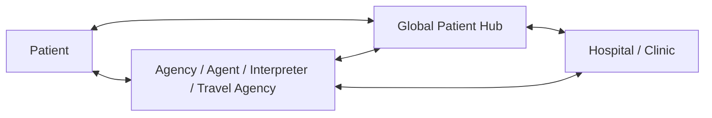
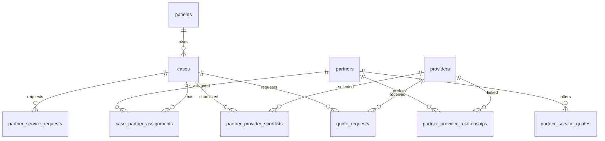

# Multi-Sided Partner Network Plan

Last updated: 2026-06-10

## Strategic Change

Global Patient Hub should evolve from a two-sided patient-provider hub into a
multi-sided care network:

The platform remains the trust, compliance, routing, audit, and settlement
layer. Partners become scoped operating participants that can help patients
with language, travel, concierge, local coordination, and hospital selection.

## Product Objective

Patients should be able to choose either:

- direct platform matching to hospitals
- partner-assisted care with an agency, individual agent, interpreter, or travel agency
- partner-originated care when the patient starts through an external partner

Partners should be able to:

- receive or create permitted patient leads
- offer non-medical support services
- see only scoped patient/case information
- review compliant hospital candidates
- select or shortlist which hospitals should receive quote requests
- manage travel, interpretation, and concierge tasks
- track service fees, revenue share, and payouts

Providers should be able to:

- receive quote requests from platform-direct or partner-assisted cases
- understand whether a case includes a partner
- confirm bookings and schedules
- keep medical quote and commission rules separated from partner service fees

## Actor Model

| Actor | Description | Main Permissions |
|---|---|---|
| Patient | Overseas patient or companion | Submit lead, request partner service, approve consent, review quotes, accept booking |
| Platform coordinator | Internal case operator | Qualify case, assign partner, run matching, approve quote flow, audit sensitive actions |
| Partner organization | Agency, travel agency, interpreter company, concierge group | Manage users, services, assigned cases, provider preferences |
| Individual partner agent | Personal agent, interpreter, travel operator | Work on assigned cases and tasks only |
| Provider | Hospital or clinic | Respond to quote requests, confirm booking, complete visit records |
| Admin | Platform operator | Verify partners/providers, approve exceptions, manage settlement and disputes |

Partner subtypes:

- overseas medical agency
- individual agent
- interpreter
- travel agency
- concierge or airport-transfer operator
- accommodation/recovery-care partner

## Core Case Modes

| Mode | Meaning | Routing Owner |
|---|---|---|
| `platform_direct` | Patient wants only hospital/package matching | Platform coordinator |
| `partner_requested` | Patient asks for agency, agent, interpreter, or travel support | Platform coordinator assigns partner |
| `partner_originated` | Lead arrives from partner referral or partner portal | Partner plus platform coordinator |
| `partner_managed` | Partner actively manages non-medical service and hospital shortlist | Partner, with platform guardrails |

The case should store one primary case mode, but it may have multiple partner
service requests attached to it.

## Patient Flows

### 1. Patient Requests Partner Support

1. Patient submits consultation form.
2. Form asks whether the patient wants help with:
   - medical agency support
   - personal agent support
   - interpreter
   - travel planning
   - airport pickup
   - accommodation or recovery support
3. Patient grants consent for selected partner service categories.
4. Platform qualifies the case.
5. Matching engine recommends both providers and eligible partners.
6. Coordinator assigns one or more partners.
7. Partner proposes support scope and may help shortlist hospitals.
8. Patient receives provider quotes and optional partner service quote separately.

### 2. Partner Creates Or Refers A Lead

1. Partner creates a lead in the partner portal or uses a referral link.
2. Patient receives a secure intake link.
3. Patient completes consent and medical/travel details.
4. Platform checks eligibility and risk.
5. Partner can follow the case only after consent and assignment.
6. Partner may shortlist providers from a compliant matching list.
7. Platform or configured rules send quote requests to selected providers.

### 3. Partner Selects Hospital Candidates

1. Case reaches `matching_ready`.
2. Platform matching engine ranks eligible providers.
3. Partner sees a partner-safe shortlist:
   - provider name
   - procedure/package fit
   - language support
   - availability window
   - estimated price range
   - compliance status
   - partner relationship status
4. Partner can:
   - pin preferred providers
   - exclude providers with reason
   - request quote from selected providers
   - ask coordinator to approve an exception
5. Platform guardrails block unverified providers, expired registrations, and
   over-cap commission paths.

## Required Data Model Extensions

The current v1 schema already has `partners`, `referral_links`, and
`partner_commissions`. For this plan, those tables should be extended rather
than treated as final.

Recommended v2 additions:

| Area | Tables / Fields | Purpose |
|---|---|---|
| Partner identity | `partner_organizations`, `partner_users`, or extend `partners` plus join table | Support agency teams and individual agents |
| Partner verification | `partner_verifications` | Verify business registration, facilitator registration if required, interpreter credentials, travel license |
| Partner services | `partner_services` | Interpreter, travel, airport transfer, accommodation, concierge, recovery support |
| Patient demand | `partner_service_requests` | Store what support the patient requested and consent scope |
| Case assignment | `case_partner_assignments` | Attach one or more partners to a case with role, status, consent scope |
| Partner-provider links | `partner_provider_relationships` | Track preferred hospitals, contract status, allowed procedures, relationship notes |
| Shortlisting | `partner_provider_shortlists` | Persist partner-selected providers and exclusion reasons |
| Service quotes | `partner_service_quotes` | Non-medical partner service pricing, separate from medical provider quotes |
| Operations | `partner_tasks`, `itinerary_items` | Interpreter schedule, airport pickup, hotel, visit logistics, aftercare |
| Finance | Extend `partner_commissions`, add `partner_service_charges` if needed | Separate revenue share from direct service fees |

Key relationship:

## Matching Architecture

The matching system should become two-stage:

### Stage A - Provider Match

Score hospitals/clinics using:

- clinical fit
- provider verification
- procedure/package availability
- language support
- travel dates and slots
- price/budget fit
- provider response SLA
- content approval status
- commission cap compliance
- partner relationship preference, if partner-assisted

### Stage B - Partner Match

Score partners using:

- requested service type
- language capability
- patient country/market
- destination city coverage
- partner verification status
- case load and SLA
- past conversion and satisfaction
- conflict-of-interest flags
- provider relationship coverage

Partner assignment should never bypass provider compliance. A partner may
prefer a hospital, but the platform must still enforce verification, content,
commission, and medical-data access rules.

## Portal Requirements

### Patient Experience

Add to public intake:

- "Do you want support from an agency, personal agent, interpreter, or travel service?"
- service categories and expected travel window
- consent scope for sharing information with selected partners
- ability to choose direct platform matching or partner-assisted matching

Add to patient case view later:

- assigned partner profile
- partner service scope and quote
- travel/interpretation schedule
- provider quote comparison
- messages split by platform, partner, and provider where appropriate

### Partner Portal

MVP screens:

- Partner Dashboard
- Partner Lead Intake
- Assigned Case Board
- Case Detail, partner-safe version
- Provider Shortlist Workbench
- Partner Service Quote Composer
- Itinerary and Task Board
- Payout and Performance Report

Partner-safe case detail should hide sensitive medical documents by default.
The partner can see only the minimum information needed for the consented
service scope.

### Provider Portal

Provider quote requests should show:

- whether case is platform-direct or partner-assisted
- partner-facing logistics contact, if allowed
- deidentified patient intake
- requested date window
- quote due time
- booking notes from partner, if approved

Providers should not see competing partners or unrelated partner revenue-share
details.

### Admin Portal

Add admin controls for:

- partner verification
- partner service catalog approval
- partner assignment and reassignment
- partner-provider relationship review
- conflict-of-interest flags
- partner shortlist override
- service quote review
- payout dispute handling

## RBAC And Consent Changes

Partner access must be case-scoped and service-scoped.

| Resource | Partner Access Rule |
|---|---|
| Lead | Own referred leads or assigned leads only |
| Patient profile | Minimal contact and travel info after consent |
| Medical intake | Redacted summary only, unless explicit consent and role require more |
| Documents | No access by default |
| Case timeline | Partner-visible events only |
| Provider match list | Compliant shortlist only |
| Quote request | Can recommend/request, platform can require approval |
| Medical quote | Read patient-facing version only when assigned |
| Partner service quote | Create/update own draft |
| Booking logistics | Read/update scoped logistics tasks |
| Settlement | Own payout only |
| Audit logs | No direct access |

Every partner data access should be auditable.

## Compliance Guardrails

This plan needs Korean healthcare regulatory review before launch.

Core guardrails:

- Keep medical fees and non-medical partner service fees separated.
- Preserve provider commission cap checks.
- Verify whether each partner subtype needs facilitator registration or other
  credentials for the specific activity.
- Do not let unverified partners access medical data.
- Do not let partner preference override provider verification.
- Label sponsored or preferential placements where applicable.
- Capture patient consent before partner data sharing.
- Audit partner access to medical or identity data.
- Define dispute rules for partner, provider, and platform responsibility.

## Implementation Phases

### Phase 0 - Planning And Compliance

- Confirm partner categories and legal requirements.
- Define consent language for partner sharing.
- Confirm medical vs non-medical fee separation rules.
- Decide whether `partners` is extended or replaced by `partner_organizations`.
- Create migration plan without breaking current referral-link model.

### Phase 1 - Patient Partner Request Signal

- Add partner-support questions to the consultation form.
- Store requested service categories in lead/case metadata.
- Let coordinators manually assign a partner in internal workflow.
- Keep partner communication manual at first.

### Phase 2 - Partner Directory And Verification

- Add partner profile, service catalog, language/country coverage.
- Add verification status and document review.
- Add admin partner verification screen.
- Add partner-safe assignment rules.

### Phase 3 - Partner Portal MVP

- Partner login and scoped RBAC.
- Partner case board.
- Partner-safe case detail.
- Partner service quote composer.
- Itinerary/task board.

### Phase 4 - Partner-Assisted Provider Shortlist

- Add partner provider-shortlist workbench.
- Add partner-provider relationship table.
- Let partners pin/exclude providers with reasons.
- Add platform approval for quote requests when required.

### Phase 5 - Settlement And Performance

- Split provider commission, partner revenue share, and partner service fees.
- Add partner payout reports.
- Add partner performance metrics:
  - lead conversion
  - quote response time
  - deposit conversion
  - no-show rate
  - patient satisfaction
  - dispute rate

## Backlog Additions

| ID | Type | Priority | Owner | Title |
|---|---|---:|---|---|
| GPH-043 | Epic | P0 | Product/Compliance | Partner-assisted care operating model |
| GPH-044 | Story | P0 | Product/Legal | Define partner subtype compliance rules |
| GPH-045 | Story | P0 | FE/BE | Add partner-support request fields to consultation intake |
| GPH-046 | Story | P0 | BE | Add partner service request and case partner assignment model |
| GPH-047 | Story | P0 | BE | Implement partner-scoped RBAC and audit rules |
| GPH-048 | Story | P1 | FE | Build admin partner assignment MVP |
| GPH-049 | Story | P1 | BE | Build partner verification and service catalog APIs |
| GPH-050 | Story | P1 | FE | Build Partner Dashboard MVP |
| GPH-051 | Story | P1 | FE/BE | Build partner-safe case board and case detail |
| GPH-052 | Story | P1 | BE | Add partner-provider relationship model |
| GPH-053 | Story | P1 | FE/BE | Build partner provider-shortlist workflow |
| GPH-054 | Story | P1 | FE/BE | Add partner service quote workflow |
| GPH-055 | Story | P2 | FE/BE | Add itinerary and logistics task board |
| GPH-056 | Story | P2 | Finance/BE | Add partner payout and dispute workflow |

## Open Decisions

| Question | Default Recommendation |
|---|---|
| Should partners choose hospitals directly? | Let partners shortlist, but keep platform/provider compliance gates mandatory. |
| Can partners view medical documents? | No by default. Use redacted summaries unless explicit consent and role justify access. |
| Should partner services be quoted with medical services? | Show together in patient UX, but store and settle separately. |
| Should individual agents and agencies use the same model? | Use one partner organization model with subtype and user roles. |
| Should patients be able to pick a partner from a directory? | Yes later, after verification, reviews, coverage, and conflict labels are ready. |
| Should partners bring their own hospitals? | Yes only after provider verification and contract/compliance onboarding. |

## Success Metrics

- Partner-request rate from consultation form
- Partner assignment acceptance rate
- Partner-assisted quote-to-deposit conversion
- Time from lead to matched provider shortlist
- Time from shortlist to quote request
- Partner SLA compliance
- Patient satisfaction by partner subtype
- Provider response rate for partner-assisted cases
- Partner payout accuracy
- Dispute rate per partner
